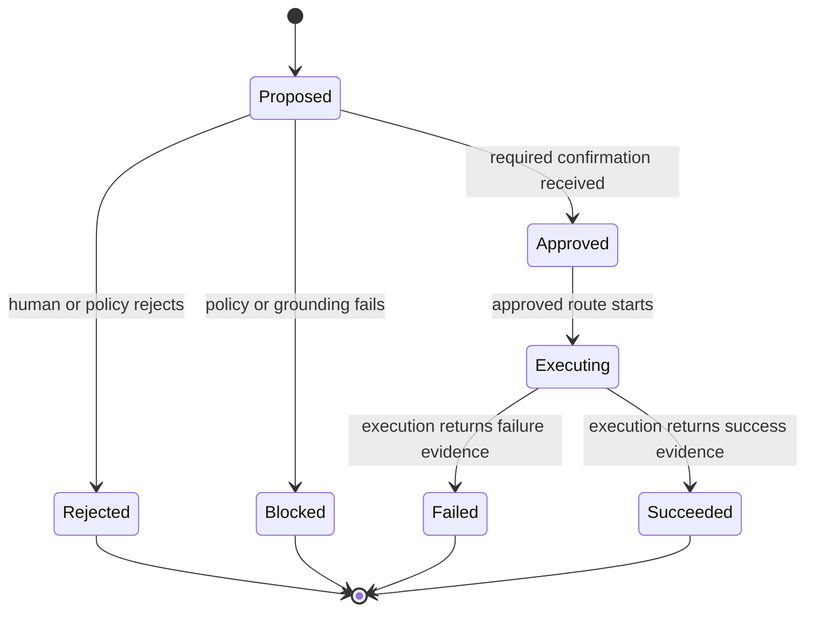

# Governed Agent Contracts

Portable JSON contracts and executable safety invariants for AI agents that can
use tools, mutate state, or cause external side effects.

This repository extracts one part of the
[TARX](https://github.com/tarx-ai) runtime into an inspectable public draft:
an agent must separate **proposal**, **decision**, **execution**, and
**evidence**. It cannot claim completion merely because a model generated text.

> **Status:** `v0.1` public design draft. This is an implementation proposal,
> not an industry standard or a claim that every TARX execution surface is
> enabled.

## The contract



The public draft contains:

- [`action-proposal.v1`](schemas/action-proposal.v1.schema.json) — intent,
  grounding, risk, confirmation, and route truth before execution
- [`action-decision.v1`](schemas/action-decision.v1.schema.json) — who or what
  approved, rejected, or blocked the proposal
- [`action-result.v1`](schemas/action-result.v1.schema.json) — execution status
  and evidence required before a completion claim
- [Examples](examples) — read-only, mutating, blocked, and successful paths
- [Executable invariants](scripts/check-contracts.mjs) — dependency-free checks
  for rules JSON Schema alone should not be trusted to communicate

## Safety invariants

1. Mutation or an external side effect requires confirmation.
2. High-risk work requires explicit confirmation.
3. A blocked proposal cannot execute.
4. A Supercomputer route must be explicitly approved.
5. An executed action must return evidence.
6. A completion claim is allowed only for a succeeded result with evidence.
7. Proposal input and evidence must not contain embedded credentials.

These contracts are deliberately model-agnostic and transport-agnostic. They
can wrap a local tool, MCP server, browser action, enterprise workflow, or
approved cloud agent.

## Run the checks

Requires Node.js 20 or later and has no package dependencies.

```sh
npm test
```

Expected output:

```text
8 contract fixtures passed
```

## Architecture boundary

This repository publishes contracts, examples, and safety invariants. It does
not publish TARX's proprietary cognitive engine, policy engine, orchestration
control plane, internal operations tools, customer data, or production
infrastructure.

## Design questions

The draft is intended to make these questions concrete:

- Which actions require a human decision versus a policy decision?
- What grounding is fresh enough to authorize a mutating action?
- How should route approval be represented across local, private, and cloud
  execution?
- What evidence is sufficient before an agent says work is complete?
- Which fields can be portable across MCP hosts and other agent runtimes?

Feedback grounded in real agent implementations is welcome through issues.

## TARX

TARX is a governed runtime for personal and enterprise AI:
**Computer by default. Supercomputer by permission.**

[TARX](https://tarx.com) ·
[Desktop](https://github.com/tarx-ai/tarx-desktop) ·
[CLI](https://github.com/tarx-ai/tarx-cli) ·
[Founder](https://github.com/wantzjt)

Copyright © TARXAN Inc. No open-source license has been granted yet; review and
feedback are welcome while reuse terms are being finalized.
